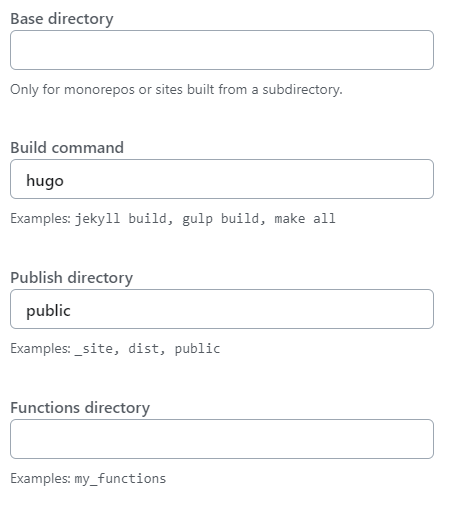
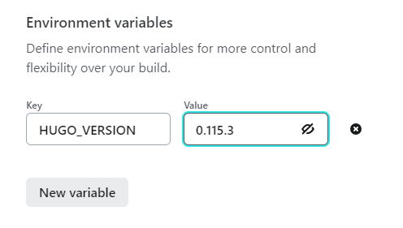

+++
title = "HugoとNetlifyで静的ブログを公開する"
date = "2023-7-17"
description = "HugoとNetlifyを使って静的ブログを無料で公開する手順を説明します。"
draft = false
header_img = ""
toc = true
tags = ["Hugo","Netlify"]
comment = true
+++

## 1. はじめに
唐突に自分を発信する場所が欲しいと思いましてブログを作ることにしました。
ただ、WordPressというかPHPに理由のないアレルギーを持っているため、別の選択肢がないかなと探していました。
その中で、Hugoのような静的サイトジェネレータの利用がWordPressのようなCMSよりもモダンであること。さらに静的サイトであればサーバー代もかからず無料で公開できる方法があるということを知りました。
そこで本記事ではHugoを使ってNetifyに静的ブログを無料で公開する手順を説明しようと思います。

## 準備
### 前提知識
#### 「静的サイトジェネレータ(SSG)」 VS 「CMS」
|              | SSG                                        | CMS                                                            |
| ------------ | ------------------------------------------ | -------------------------------------------------------------- |
| コンセプト   | 静的なHTMLファイルを生成                   | 動的なコンテンツをデータベースから生成                         |
| 利用用途     | 個人ブログ、ポートフォリオなど静的なサイト | ブログ、企業ウェブサイト、などコンテンツの更新頻度が高いサイト |
| データベース | 不要                                       | 必要                                                           |
| ホスティング | 静的ファイルホスティング                   | サーバー上にCMSをインストール                                  |
| 人気のツール | Jekyll、Hugo、Gatsbyなど                   | WordPress、Drupal、Joomlaなど                                  |


#### Hugo
- Go言語で開発されたオープンソースの静的サイトジェネレータ
- 豊富なテーマライブラリがあり、簡単にカスタマイズできる
- マークダウン記法でコンテンツを作成できる
#### Netlify
- 静的サイトのホスティングを提供するプラットフォーム
- GitHubなどのバージョン管理システムと連携して自動的にサイトを更新
- 一定の無料枠がある

### 環境
Ubuntu 22.04 on WSL  
hugo_extended_0.115.3_linux-amd64.deb

## Hugoのインストール
```shell
$ wget https://github.com/gohugoio/hugo/releases/download/v0.115.3/hugo_extended_0.115.3_linux-amd64.deb
$ sudo dpkg -i hugo_extended_0.115.3_linux-amd64.deb
```

## ブログを作成する
公式のチュートリアルがとても分かりやすいため、こちらに沿って行います。  
[Hugo クイックスタート](https://gohugo.io/getting-started/quick-start/)

### プロジェクトの作成
```shell
$ hugo new site quickstart
```
### テーマの設定
今回はPuppetというテーマがとてもシンプルで気に入ったので利用しています。
```shell
$ cd quickstart
$ git init
$ git submodule add https://github.com/roninro/hugo-theme-puppet.git themes/puppet
$ git submodule update --init --recursive
$ cp themes/puppet/exampleSite/config.toml .
$ rm hugo.toml
$ mv config.toml hugo.toml
```
テーマの設定が完了したのちに開発サーバーを立ち上げてみるとエラーがでました。
```
$ hugo server
Hugo provides its own webserver which builds and serves the site.
While hugo server is high performance, it is a webserver with limited options.

'hugo server' will avoid writing the rendered and served content to disk,
preferring to store it in memory.

 ・・・

 ・・・
 Error: command error: failed to load modules: module "puppet" not found in "/puppet"; either add it as a Hugo Module or store it in "/".: module does not exist
```
調べてみると、`hugo.toml`の`themsDir`をテーマディレクトリに設定する必要があるようです。
なので以下のように修正を行い、再度開発サーバーを立ち上げると http://localhost:1313/subdir/ アクセスできるようになりました。
```toml:hugo.toml
 ・・・

themesDir = "themes"

 ・・・
```
### 新しいページを追加
```shell
$ hugo new posts/my-first-post.md
```
`content/posts/my-first-post.md`を編集します。
```:my-first-post.md
+++
title = "ここにタイトルが入ります"
date = "2023-01-01"
description = ""
draft = false
subtitle = ""
header_img = ""
toc = true
tags = []
categories = []
series = []
comment = true
+++

ここからが本文です。
マークダウン形式で記載します。
```
### 開発サーバーの起動
```
$ hugo server
```
http://localhost:1313/subdir/ にアクセスすると作成したページが表示されます。

### 静的サイトの作成
```
$ hugo
```
コマンド実行後、プロジェクトのルートディレクトリに`public`ディレクトリが作成されます。
これで、ブログの作成は完了です。この後、作成したブログをNetlifyを使って公開していきます。
NetlifyではGitHubのレポジトリをリンクするため、作成したブログをGitHubにpushしておきましょう。
　　

## Netlifyで公開する
### Netlifyのアカウント作成
1. https://app.netlify.com/ にアクセスします。
2. GitHub を選択し、認証を行います。

### ホスト設定
1. `Add new site`をクリックし、`Import an existing project`を選択します。
2. `Deploy with GitHub`をクリックし、インポートしたいレポジトリを選択します。
3. `Build command`に`hugo`、`Publish directory`に`public`を入力します。
   
4. `Environment variables`に`HUGO_VERSION`を入力します。
   
5. `Deploy [レポジトリ名]`をクリックします。

`hugo`コマンドでビルド中に以下のようなエラーで失敗しました。
```
Error: Unable to locate config file or config directory. Perhaps you need to create a new site.
      Run `hugo help new` for details
```
調べてみると、別途`netlify.toml`を作る必要があるそうです。
```:netlify.toml
[build]
  command = "hugo"
  publish = "public"

[build.environment]
  HUGO_VERSION = "0.115.3"
```
これをプロジェクトのルートディレクトリに保存して、GitHubにpush。
その後、再度手順1から行うと、無事ホストされました。
と思いきや、割り振られたドメインにアクセスしてみると、CSSが仕事をしていない。
調べてみると、`hugo.toml`の`baseURL`を設定しなおす必要があるとのこと。
以下のようにnetlifyで割り振られたドメインに変更します。
```
baseURL = "netlifyで割り振られたドメイン"
```
再度GitHubにpushすると、無事表示されました！

## 参考
◆Hugoのチュートリアル
https://gohugo.io/getting-started/quick-start/
◆Host on Netlify 
https://gohugo.io/hosting-and-deployment/hosting-on-netlify/
◆Hugo on Netlify
https://docs.netlify.com/integrations/frameworks/hugo/


